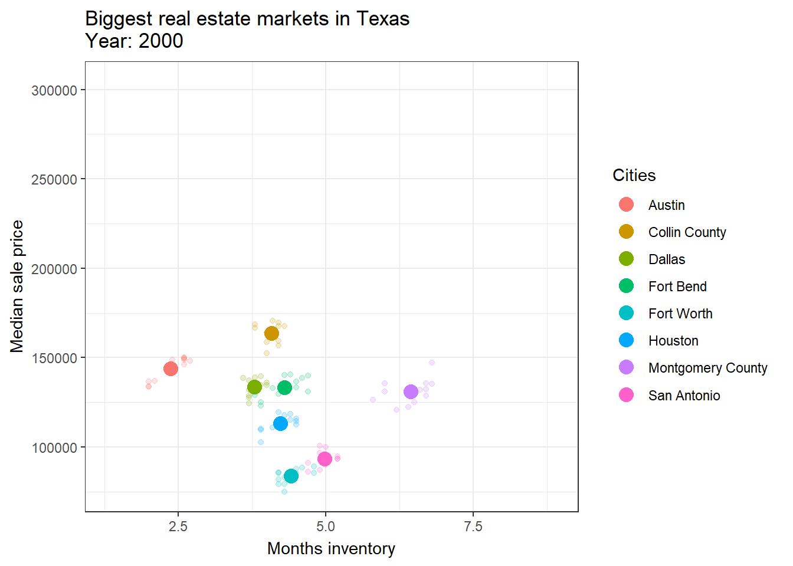

# ggplot project for the course Applied Data Analysis and Visualisation.

Made together with Dominic and Netanja.

## Repository content

This was a small project to create an innovative ggplot visualisation for extra credit.
We decided to build an animated plot visualising the development of several Texas real estate housing markets over time, based on the `txhousing` dataset.
As this was just a small project, we did not iterate on it, like adding lines showing the movement over time or signifying special values or cutoffs on the plot.

